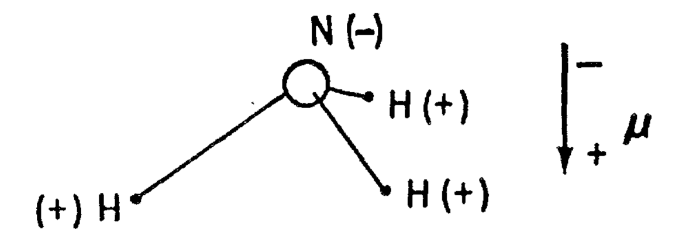
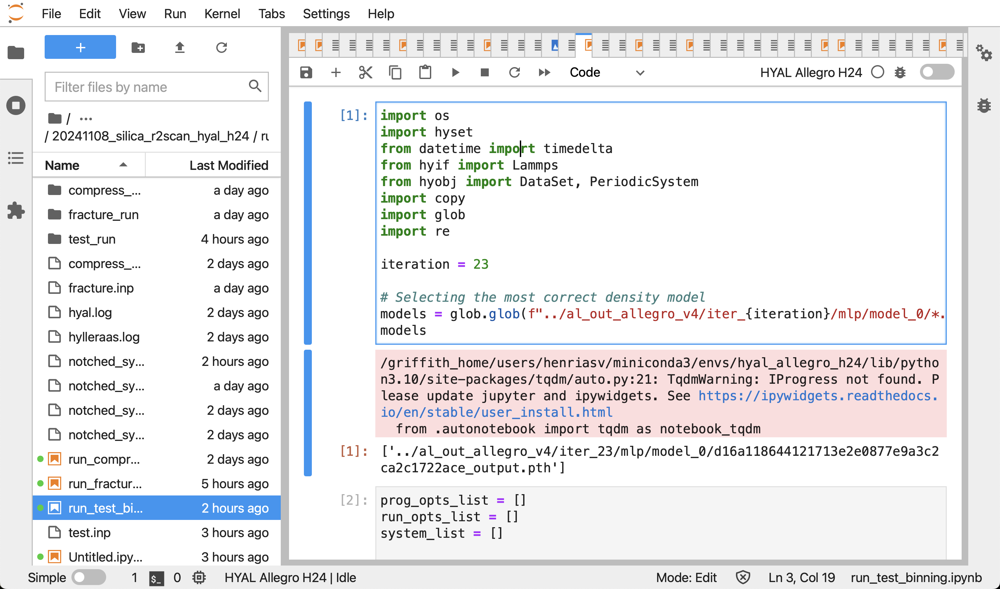
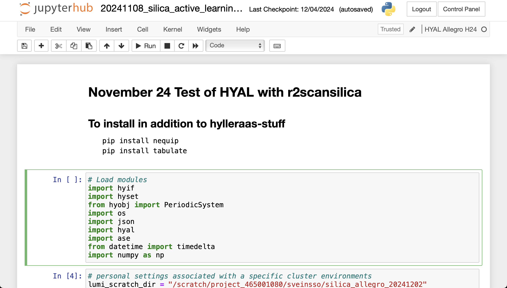
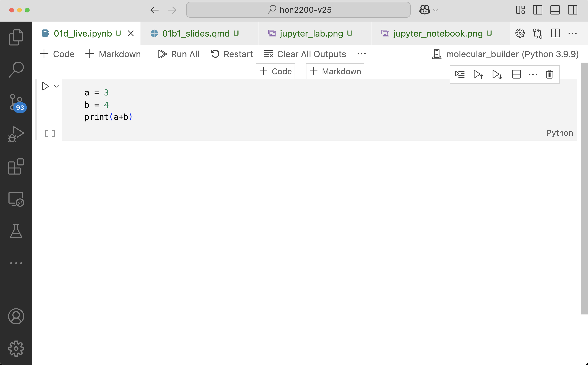

## Slide-versjon

<iframe src="01b1_slides.revealjs.html" width="960" height="540"></iframe>


## Data-dreven? 
:::: {.columns}

::: {.column width="40%"}
I dag:

- Eksempler på problemstillinger som trenger data
- Kunne lese inn og utforske datasett i jupyter notebook m/numpy, pandas og matplotlib
:::

::: {.column width="60%"}

:::
::::


:::{.notes .hidden}
Vi skal jobbe med situasjoner der vi kan bruke data til å ta en eller annen beslutning. Så skal vi vurdere om dataene er egnet til å ta beslutningen, og både om det er etiske forsvarlig å ta beslutningen basert på dataene, og om vi burde det. 

Ha lav terskel for å spørre om det er ting dere ikke forstår. Vi må tune oss litt inn på hverandre her.
:::

## Praktisk info

- Undervisning på fredager 08:15–10:00
- 1 oblig (frist om en god stund)
- 2 prosjekter 
- Muntlig eksamen
- Nettressurser lenket fra emnesiden. Disse endres gjennom semesteret

## Undervisere 
:::{.absolute top=80 left=0 width=550}
:::{.callout-warning icon=false}
## Henrik Sveinsson (Emneansvarlig)
- Forsker i fysikk
:::
:::

:::{.absolute top=80 left=570 width=500}
:::{.callout-note icon=false}
## Ane Kristine Espeseth (Seminarlærer)
- Jobber med doktorgrad i kunstig intelligens
:::
:::

:::{.absolute top=260 left=0 width=550}
:::{.callout-tip icon=false}

## Aksel Sterri (Digital etikk)
- PhD i filosofi
- Forskningsdirektør i tenketanken *Langsikt* 

{width=200px} 
:::
:::


## Plan for semesteret
:::{.callout-note}
## Statistikk og databehandling (januar-februar)
- Forstå og anvende sentrale konsepter innen statistikk (Lineær og logistisk regresjon, Beslutningstrær)
- forstå, bearbeide, analysere og visualisere datasett av moderat størrelse på en informert måte, samt trekke etterprøvbare konklusjoner
:::

:::{.callout-warning}
## Digital etikk (mars)
- vurdere etiske utfordringer med KI-algoritmer 
- se hvordan opprinnelsen til et datasett legger føringer og begrensninger på
hva man kan bruke datasettet til
:::

:::{.callout-tip}
## Prosjektoppgave (mars-mai)
- Jobbe med prosjekt i tverrfaglige team og kommunisere resulatene muntlig og skriftlig
:::

## Husk
- Hjelp hverandre (skal vi sette opp grupper?)
- Følg med på semestersidene
- Studentrepresentanter 
- Still gjerne spørsmål etter timen
- Send mail om det er noe


## More is different 


:::{.notes .hidden}
I fysikken, så finnes det en ganske berømt artikkel som heter "More is different". Den handler kort sagt om at når ting blir store nok, så endrer de kvalitativt egenskaper, og blir til noe annet enn summen av delene. Dette er grunnen til at det ikke holder med kvantefysikk og høyenergi partikkelfysikk for å skjønne hele verden. Det holder ikke med standardmodellen i partikkelfysikk om du skal forklare hvordan et jordskjelv oppstår. 

Bildet her viser et eksempel. Dette er et ammoniummolekyl. Det består av et nitrogenatom, og tre hydrogenatomer. og de står alle sammen som et tetraeder, altså en trekantet pyramide. På grunn av kvantefysikk er det noen elektronen som svirrer rundt mellom nitrogenet og hydrogenet, og nitrogenet trekker hardere på elektronene enn det hydrogenene gjør. Derfor vil man, om man måler, finne at det i snitt er litt negativ ladning ved nitrogenet og litt positiv ladning ved hydrogenene. Så langt så bra. Dette skulle man tro var helt greit, men det er det ikke. For i følge kvantefysikken kan ikke stasjonære tilstander ha netto dipolmoment. Og det er jo litt trøblete. For hvis kvantefysikken ikke en gang klarer å forholde seg til ammonium, da er den ikke mye verdt. Men selvsagt blir vi reddet. For ammoniummmolekylet står og svinger fra å ha hydrogenene under seg til å ha dem over seg. Så over tid er det netto null forskjell i ladning oppe og nede. Men, dette går bare fint, fordi ammoniummolekylet lett kan svinge slik. Om vi hadde noe større, for eksempel et protein, ville det ikke klart å vrenge seg. Det som skjer da, er at molekylet låser seg fast i en metastabil tilstand. Om man ser på gjennomsnittet av alle ting den kunne ha gjort, oppfyller den kvantemekanikken, men det blir uinteressant om vi skal se på strukturen til et enkelt protein. Det har låst seg fast i en eller annen sær struktur, og det kommer til å ta den mange ganger universets levetid å utforske nok mulige konfigurasjoner til å kunne nærme seg å oppfylle kravet til jevn ladningsfordeling.  I stedet gjør den en eller annen viktig jobb slik som for eksempe å fange opp spike-proteinet i coronaviruset. 

I maskinlæring og stordata er noe lignende i ferd med å skje. Vi er i ferd med å komme inn i et regime der vi kan erstatte mye menneskelig intelligens med maskinintelligens, fordi maskinintelligensen har blitt kvalitativt endret.

Lenge prøvde man å beskrive for datamaskinen hva som var de forskjellige karakteristiske trekkene ved forskjellige objekter. Nå bare viser man den nok eksempler, og den finner det ut selv. Det er bare noen år siden denne teknologien plutselig suste forbi alle de andre teknologiene, og gjorde at vi nå kan tro på det når internett sier at noe er et bilde av en katt. Og det kommer av to ting: Mer data, og mer regnekraft, slik at man kan lage større nevrale nettverk og trene dem bedre. Plutselig klarer disse nettene å gjøre noe nytt.

Lenge prøvde man å fysikkmodellere seg til å predikere proteinstrukturer fra gensekvenser. I praksis se på hvordan proteinkjeder knyter seg til og låser seg fast i en metastabil tilstand.  Nå gjør google DeepMind dette med maskinlæring.
:::

## SHOT
> Omtrent 4 av 10 studenter (42 %) oppgir at de har god eller svært god livskvalitet. Samtidig vurderer 31 % av studentene sin livskvalitet som litt under middels eller dårligere

:::{.incremental}
- Bør vi sette inn tiltak? 
 
- **Studenter flest mener de har det bedre enn snittet (!)**
:::

:::{.notes .hidden}

Hvordan skal vi tolke dette utsagnet? 

Her skal vi se på situasjoner det statistikk oppgis på en lite hensiktsmessig måte. 

:::


## Sjåfører
::: {.fragment .fade-out}
```{python}
#| echo: true
#| eval: false
import matplotlib.pyplot as plt 
import pandas as pd
ferdighetsnivå = ["Veldig god", "Bedre enn snittet", "Gjennomsnittlig", "Under snittet", "Veldig dårlig"]
andel = [21, 46, 31, 2, 1]
plt.barh(ferdighetsnivå, andel)
plt.tick_params(axis='y', labelsize=20) 
```
:::

```{python}
#| echo: false
#| eval: true
import matplotlib.pyplot as plt 
import pandas as pd
ferdighetsnivå = ["Veldig god", "Bedre enn snittet", "Gjennomsnittlig", "Under snittet", "Veldig dårlig"]
andel = [21, 46, 31, 2, 1]
plt.barh(ferdighetsnivå, andel)
plt.tick_params(axis='y', labelsize=20) 
```


:::{.fragment .absolute top=0 left=200 width="900" height="300"}
:::{.callout-note background-color="aquamarine"}
## Hva så?
:::{.incremental}
- Henger dette på greip?
- Kan dette i prinsippet henge på greip?
- Kom med en hypotese basert på dette datasettet.  
- Hvilke data trenger du å samle inn for å vurdere hypotesen din? 
:::
:::
:::

:::{.notes .hidden}
Sjåfører flest er bedre enn snittet ? 

Dette bør vi ha i mente når vi leser at folk rapporterer om forskjellige ting. 

En ting jeg ønsker meg for dere i dette faget, er at dere skal få et bredt spekter av ideer når dere ser en graf som denne. Eller i det minste bredere enn dere hadde før. At det å jobbe med data sammen med andre fra ulike fagbakgrunner gjør at dere får noen aha-opplevelser om hva som er forskjellige sanne, eller i det minste plausible, historier som kan fortelles fra samme datasett. 
:::


## Å kunne håndtere data med Pandas


:::{.notes .hidden}
Når vi har data tilgjengelig trenger vi en måte å håndtere dem på! 

Jeg håper vi nå er enige om at det finnes ting som vi bryr oss om som vi kan finne ut av dersom vi klarer å få tak i og håndtere data. Derfor skal vi nå begynne med å se på hvordan vi håndterer data i jupyter notebook, særlig ved hjelp av Pandas. 
:::

## Aritmetikk i jupyter notebook
(Prøv å kjøre dette i egen notebook, meld ifra med postitlapp om det ikke er mulig å holde følge)
```{python}
#| echo: true
a = 3
b = 4
c = a*b
print("a*b = %i"%(a*b))
```

:::{.notes .hidden}
Nå vil jeg at vi skal ta fram postitlapper, slik at dere kan sette grønn lapp på maskinen om det virker, og rød lapp om det er trøbbel. 
:::

## Legge til ny/fjerne celle
Kommer an på VSCode/jupyter notebook/juyter lab

::: {.r-stack}
{.fragment .absolute top=70 left=70 width="950"}

{.fragment .absolute top=70 left=70 width="950"}

{.fragment .absolute top=70 left=70 width="950"}
:::

:::{.fragment}
Legg til en ny celle i din notebook
:::


## Bruke celle til tekst (inkl. latex)
- Sette celletype til "Markdown"

## Markdown-celle

```{raw}
Her kan jeg skrive tekst-innhold, likninger og slikt. 
$\int_0^\infty f(x) dx$
```

:::{.callout-note}
## Markdown-celle
Her kan jeg skrive tekst-innhold, likninger og slikt. 
$\int_0^\infty f(x) dx$
:::

## Installere pakker i Jupyter
- `!pip install <pakkenavn>`

```{python}
#| eval: false
#| echo: true
!pip install matplotlib
```

. . .

- Legge på `-q` (quiet) for å ikke spamme output-cellen

```{python}
#| eval: false
#| echo: true
!pip install -q matplotlib
```

. . .

- Med følgende får vi gjort mye: 

```{python}
#| eval: false
#| echo: true
!pip install -q matplotlib numpy pandas
```

## Importere pakker 
```{python}
#| echo: true
import numpy as np
import matplotlib.pyplot as plt
import pandas as pd
```

. . .

:::{.callout-important}
## Feilmeldinger?
Funker installasjon og import av disse pakkene? Opp med grønn/rød postit!
:::

## Håndtere data i python/jupyter
- Lagre data i numpy-arrayer 
- Plotte data med matplotlib
- Håndtere data med pandas DataFrames

## Numpy-arrayer
(trenger ikke kode med her)

:::{.fragment}
```{python}
#| echo: true
import numpy as np
a = np.array([2, 3, 4, 5])
b = np.linspace(0, 4, 10)
display(b)
```
:::

:::{.fragment .fade-in}
```{python}
#| echo: true
def f(x):
    return np.exp(-x**2)

a = np.linspace(-4, 4, 15)
y = f(a) 
display(y)
```
:::

## Plotting med matplotlib

```{python}
#| echo: true
#| eval: true
import matplotlib.pyplot as plt
plt.plot(a, y)
plt.xlabel("a")
plt.ylabel("f(x)")
```


## Matplotlib
:::{.fragment .fade-out .callout-note}
## Oppgave
Kan du få plottet til å bli glattere? 

```{python}
#| echo: true
#| eval: false
import matplotlib.pyplot as plt
import numpy as np
def f(x):
    return np.exp(-x**2)

a = np.linspace(-4, 4, 15)
y = f(a) 
plt.plot...
plt.xlabel...
plt.ylabel...
```
:::

:::{.fragment .absolute top=80 left=0}
```{python}
#| echo: true
#| eval: true
import matplotlib.pyplot as plt
a = np.linspace(-4, 4, 101)
y = f(a)
plt.plot(a, y)
plt.xlabel("a")
plt.ylabel("f(x)")
```
:::

:::{.fragment .absolute top=80 left=0}
```{python}
#| echo: true
#| eval: true
import matplotlib.pyplot as plt
a = np.linspace(-4, 4, 101)
y = f(a)
plt.plot(a, y)
plt.xlabel("a")
plt.ylabel("f(x)")
```
:::

## Lage Pandas DataFrame manuelt 

:::{.notes}
Når vi skal jobbe med data som passer på tabellformat kan livet vårt bli svært mye enklere om vi brukere et bibliotek som heter pandas. Det skal da lite kode til for å lese inn filer og for å gjøre enkle plots. Dessuten passer dataformatet i pandas sammen med flere kjente maskinlæringsbiblioteker som pytorch og scikit-learn. Dermed slipper vi å bruke tid på å manipulere data til å passe inn i spesifikke formater for hvert bibliotek vi skal bruke.

Når man bruker kraftige biblioteker for databehandling, vil det alltid være mange funksjoner man ikke kan navnet på, eller ikke vet hva gjør. Det er helt greit, og helt vanglig. Det er lov til å si at man “kan pandas” uten å vite hva alle funksjonene gjør, på samme måte som det er lov å si man kan engelsk selv om man ikke vet betydningen av *floccinaucinihilipilification*. Derfor kommer det til å være mange ting jeg ikke vet om pandas, men jeg føler meg ganske komfortabel med å bruke det allikevel.

Det viktigste konseptet i pandas er et DataFrame. Det lager vi på denne måten, og det er en type tabell.
:::
```{python}
#| echo: true
import pandas as pd
df = pd.DataFrame({
    "talent" : [4, 5, 3, 4, 6, 2],
    "innsats" : [2, 4, 3, 7, 4, 1],
    "resultat" : [24, 73, 25, 204, 93, 4]
})
print(df)
```
:::{.fragment .callout-note}
## Oppgave
Skriv inn dette i notebooken din, og kjør koden (vi trenger det etterpå)
::: 

## Plotte fra DataFrame
```{python}
#| echo: true
plt.plot(df["talent"])
_ = plt.ylabel("Talent")
```

## Flere plots i samme figur 
```{python}
#| echo: true
fig, axes = plt.subplots(2,2, figsize=(4,5))
axes[0,0].scatter(df["innsats"], df["talent"])
axes[0,0].set_xlabel("Innsats")
axes[0,0].set_ylabel("Talent")
plt.tight_layout()
```

:::{.fragment .absolute top=300 left=500 width=300}
:::{.callout-note}
## Oppgave
Fullfør plottet og finn ut hva som er viktigst av innsats og talent.
:::
:::


## Laste inn fra fil

```{python}
#| echo: true
import pandas as pd
df_pris = pd.read_csv("data/meteringvalues-dec-2024.csv", sep=";", decimal=",")
print(df_pris)
```

## Ting kan gå galt 

```{python}
#| echo: true
import pandas as pd
df_pris = pd.read_csv("data/meteringvalues-dec-2024.csv")
print(df_pris)
```

## Ting kan gå galt 2

```{python}
#| echo: true
import pandas as pd
df_pris = pd.read_csv("data/meteringvalues-dec-2024.csv", sep=";")
print(df_pris)
```

## Hente ut kolonner 
```{python}
df_pris = pd.read_csv("data/meteringvalues-dec-2024.csv", sep=";", decimal=",")
df_pris["KWH 60 Forbruk"]
```

## Plotting

:::{.callout-note}
## Oppgave
Last ned datasettet med strømforbruk (finnes under oppgavene på kursnettsiden)
Plott kolonnen "KWH 60 Forbruk"
:::

Starthjelp: 
```{python}
#| eval: false
#| echo: true
import pandas as pd
df_pris = pd.read_csv("data/meteringvalues-dec-2024.csv", 
    sep=";", 
    decimal=",")
```
Om du blir ferdig, start på oppgave 2 fra øvingsoppgavene. 


## Til neste uke 
- Gjør oppgavene som vi har gitt dere
- Gjør forberedelsene som vi har satt opp 

:::{.callout-note collapse="true"}
## Hvor mye tid tar HON2200 per uke? 
6–7 timer? 
:::


