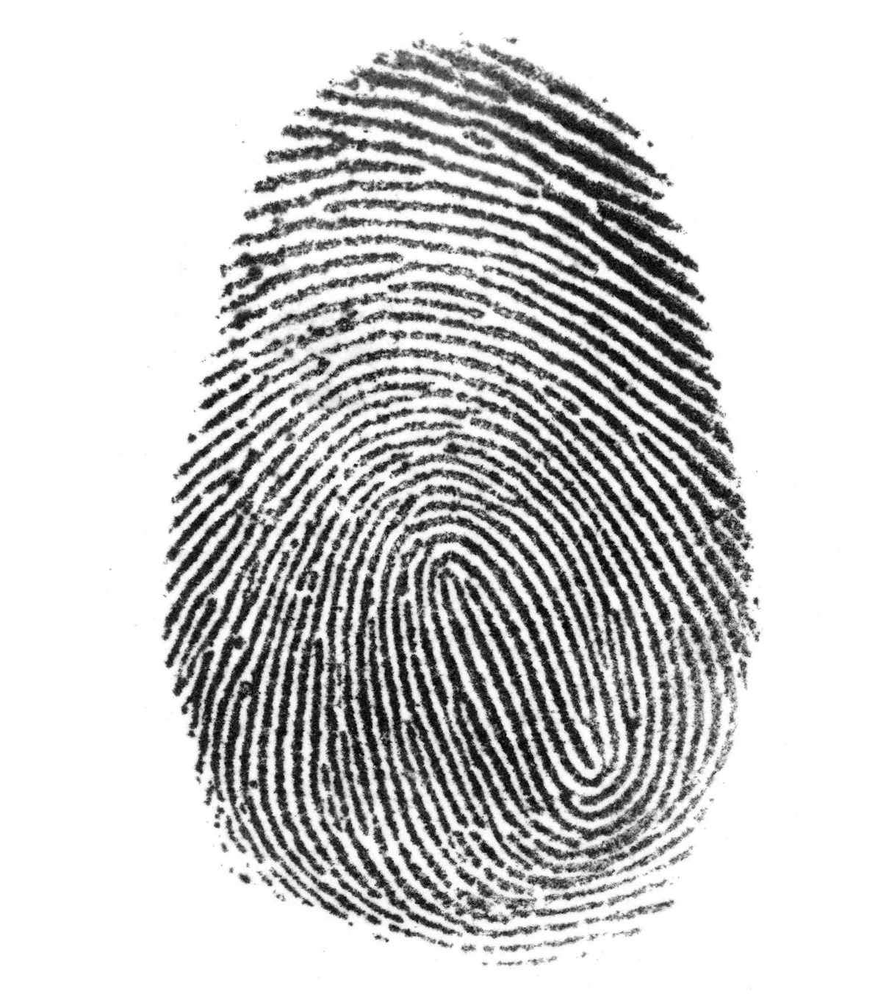
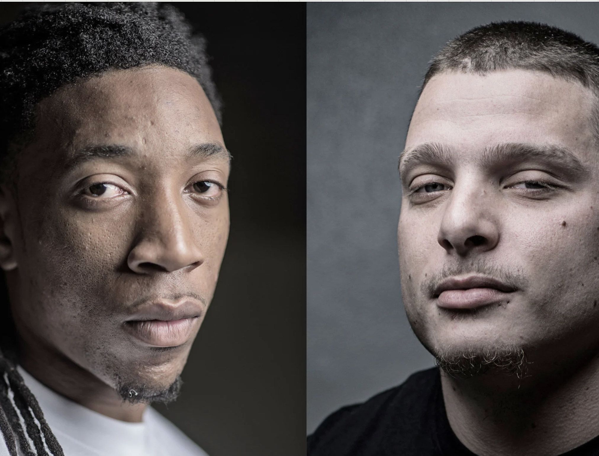

---
format:
   html:
     theme: cosmo
     toc: true
     toc-location: right
     number-sections: false
     fontcolor: black
     show-notes: true
   revealjs:
     theme: sky
     output-ext: revealjs.html
---

# Compas-prosjektet

En øvelse i betingede sannsynligheter. 

## Betinget sannsynlighet eksempel

::::{.columns}
:::{.column width="30%"}
{width=250}
:::

:::{.column width="70%"}
Politiet i Oslo har begynt å gå igjennom alle fingeravtrykkene sine, og nå har de funnet et matchende fingeravtrykk i en drapssak. Anta at vi har følgende sanne påstander:
:::
::::

- Sannsynligheten for at fingeravtrykket matcher, gitt at personen er skyldig, er 99.9 prosent.
- Sannsynligheten for at fingeravtrykket matcher gitt at personen er uskyldig, er 0.0001 prosent.

::: {.notes}
Les opp oppgaven sakte. Ikke kommenter tallene ennå — la studentene sitte med dem og danne sin egen intuisjon. De fleste vil tenke at personen nesten sikkert er skyldig. Ikke rett på det ennå.
:::

## Medieframstillingen blir så klart
:::{.fragment}
... at politiet nesten garantert har funnet rett person. Har du noen innvendinger?
:::

:::{.fragment}
:::{.callout-note}
## Informasjonen du har
Politiet i Oslo har begynt å gå igjennom alle fingeravtrykkene sine, og nå har de funnet et matchende fingeravtrykk i en drapssak. Anta at vi har følgende sanne påstander:

- Sannsynligheten for at fingeravtrykket matcher, gitt at personen er skyldig, er 99.9 prosent. 
- Sannsynligheten for at fingeravtrykket matcher gitt at personen er uskyldig, er 0.0001 prosent. 
:::
:::

## Litt mer formelt oppstilt
$$P(\mathrm{match}|\mathrm{uskyldig}) = 0.000001$$
$$P(\mathrm{match}|\mathrm{skyldig}) = 0.9990$$

**Norge:** 5 millioner innbyggere i en alternativ virkelighet der politiet har alles fingeravtrykk.

Hva er sannsynligheten for at personen som har matchet er skyldig?

::: {.notes}
Gi dem et minutt til å tenke. Nøkkelen er at de må innse at de trenger å vite noe om *hvor mange* som testes — altså «base rate». 5 millioner uskyldige som hver har en bitteliten sjanse for å matche gir til sammen ganske mange falske matcher. Spør gjerne: «Hvor mange uskyldige forventer vi matcher?» Det gjør overgangen til neste slide lettere.
:::

## Hvor sannsynlig at den de har funnet er skyldig?

$$P(\mathrm{skyldig}|\mathrm{match})?$$

Med tallene vi har: $P(\mathrm{match}|\mathrm{uskyldig}) = 0.000001$ og $P(\mathrm{match}|\mathrm{skyldig}) = 0.9990$, vil vi forvente å finne 4.9999990 match blant de uskyldige, og 0.999 match blant de skyldige, dersom den skyldige er i befolkningen.

Altså: 

$$P(\mathrm{skyldig}|\mathrm{match}) = 0.999/5.998999 = 0.16653..$$

::: {.notes}
Reaksjonen pleier å være overraskelse — bare 17%! Dvel ved dette. Selv med en ekstremt god test (99.9% treffsikkerhet) drukner det ene riktige treffet i støy fra millioner av uskyldige. Denne feiltolkningen har et navn: «prosecutor's fallacy», og har ført til justismord i virkeligheten — bl.a. Sally Clark-saken i Storbritannia der en statistiker vitnet feil om sannsynligheten for to krybbedød i samme familie. Et annet eksempel: screening for sjeldne sykdommer gir mange falske positive av nøyaktig samme grunn.
:::

## Bayes' setning
$$P(B|A) = \frac{P(A|B) \cdot P(B)}{P(A)}$$

$$P(\mathrm{skyldig}|\mathrm{match}) = \frac{P(\mathrm{match}|\mathrm{skyldig}) \cdot P(\mathrm{skyldig})}{P(\mathrm{match})}$$

## Med tall innsatt
Vi fikk oppgitt at 
$P(\mathrm{match}|\mathrm{uskyldig}) = 0.000001$
$P(\mathrm{match}|\mathrm{skyldig}) = 0.9990$

Vi kan anta at 
$P(\mathrm{skyldig}) = 1/5000000$
$P(\mathrm{match}) = P(\mathrm{match}|\mathrm{skyldig}) \cdot P(\mathrm{skyldig}) + P(\mathrm{match}|\mathrm{uskyldig}) \cdot P(\mathrm{uskyldig})$
Setter inn tall
$P(\mathrm{match}) = 0.9990 \cdot \frac{1}{5000000} + 0.000001 \cdot \frac{4999999}{5000000} = 0.0000011998$

$$P(\mathrm{skyldig}|\mathrm{match}) = \frac{0.9990 \cdot \frac{1}{5000000}}{0.0000011998} = 0.16653$$

::: {.notes}
Poenget med å gjøre det formelt er at studentene skal se at den intuitive utregningen og Bayes gir nøyaktig samme svar. Bayes er ikke magi — det er bare en systematisk måte å gjøre det vi allerede gjorde med telling. Fordelen er at formelen fungerer også når vi ikke kan telle direkte, f.eks. når vi ikke vet eksakt hvor mange som er skyldige.
:::

## Et par ting

- måtte jeg være veldig nøye på hvordan jeg formulerte denne oppgaven, for at den ikke skulle bli meningsløs? 

> Politiet i Oslo har begynt å gå igjennom alle fingeravtrykkene sine, og nå har de funnet et matchende fingeravtrykk i en drapssak. 

vs

> Politiet i Oslo har gått igjennom alle fingeravtrykkene sine, og har funnet et matchende fingeravtrykk i en drapssak.

::: {.notes}
Forskjellen er subtil men avgjørende. I den første formuleringen har de «begynt å gå igjennom» — de stoppet da de fant en match, fordi de trodde de var ferdige. Men vi vet jo at det sannsynligvis finnes ca. 5 andre matcher der ute som de aldri sjekket. I den andre formuleringen har de gått igjennom *alle* — og om de da bare finner én match, er det mye sterkere bevis. Poenget: stopper du når du tror du er ferdig, eller sjekker du faktisk alt? Det er lett å overbevise seg selv for tidlig.
:::

## COMPAS-prosjektet
:::{.columns}

:::{.column}

:::

:::{.column}
Statistiske størrelser slik som disse:  
$P(\mathrm{gjentagelse}|\mathrm{hvit})$  
$P(\mathrm{gjentagelse}|\mathrm{svart \ mann})$  

på gruppenivå, får konsekvenser på individnivå. På en rettferdig eller urettferdig måte, kanskje.
:::

::: {.notes}
Nå kan du trekke linjen tilbake til fingeravtrykk-eksempelet: COMPAS gir en risikoskår basert på gruppestatistikk, men den brukes til å ta beslutninger om enkeltpersoner — akkurat som fingeravtrykk-matchen. Og akkurat som der: hvem du sammenligner med (base rate) endrer alt. ProPublica fant at svarte med lav risiko ble feilklassifisert som høy risiko dobbelt så ofte som hvite. Northpointe svarte at algoritmen er like presis for begge grupper (lik positiv prediktiv verdi). Begge har rett — og det er nettopp poenget. Artikkelen til Kleinberg (som de har lest) viser matematisk at man ikke kan oppfylle begge rettferdighetskravene samtidig når base rate er ulik mellom gruppene. Spørsmålet «hva er rettferdig?» er altså ikke bare filosofisk — det handler om hvilken betinget sannsynlighet du velger å holde lik. Og det er det prosjektet handler om.
:::

## Gruppeinndeling

## Begynne med prosjektet

- Les prosjektbeskrivelsen og begynn å jobbe med dataene i dag.
- Veiledningstimer: 27. mars og 10. april.
- **Frist for innlevering: 16. april.**

::: {.notes}
Oppfordre dem til å begynne med oppgave a) i dag — les inn dataene og lag de første plottene. Det viktigste er å komme i gang og se hvordan dataene ser ut. Minn dem på at prosjektrapporten skal kunne leses uten å ha lest oppgaveteksten, så de bør tenke på struktur tidlig. Orakeltimer torsdager kl. 16:15–18:00 i Tellefsens tårn er også en god ressurs.
:::
