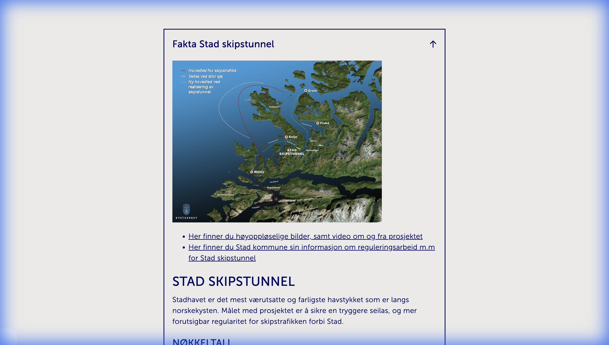
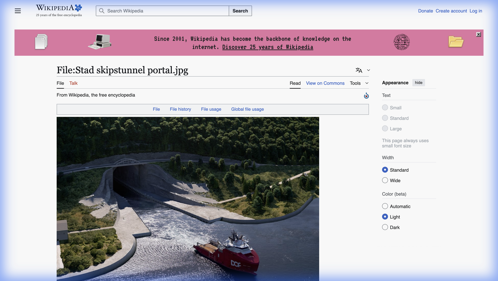

## Hook

::: {.r-fit-text}
Norge bygger et prosjekt til **9,4 milliarder kroner**  
som alle eksperter er enige om **ikke lønner seg**.
:::

. . .

Og Stortinget har nettopp bestemt at det skal gjøres *likevel*.

::: {.notes}
Start med å fange oppmerksomheten. La studentene reagere på paradokset: Hvorfor bygge noe som ikke lønner seg?
:::

---

## Stad skipstunnel – Verdens første

{width="80%"}

::: {.incremental}
- **Ytre led** (rød): Stadhavet – Norges farligste havstrekning
- **Tunnelen** (blå): 1700 meter gjennom fjellet, 50m høy, 36m bred
- **~100 dager i året** er Stadhavet for farlig å krysse
:::

::: {.notes}
Vis kartet og forklar de to alternativene. Poenget er at den ytre ruten er farlig, men har vært den eneste muligheten i tusen år.
:::

---

## Fysikken – Hva dataene sier

| Fakta | Verdi | Kilde |
|-------|-------|-------|
| Dager med stengt seilas | ~100 per år | Kystverket |
| Dødsfall siden 1945 | 33 | Kystverket |
| Signifikant bølgehøyde (vinter) | 4–6+ meter | Havforskningsinstituttet |

. . .

> **Spørsmål:** Fysikken forteller oss at Stadhavet er farlig.  
> Men *hvor farlig* er farlig nok til at det er verdt 9 milliarder?

::: {.notes}
Dette er den naturvitenskapelige siden: Vi kan måle bølgehøyde, vindstyrke, ulykker. Men tall alene gir ikke svaret.
:::

---

## Økonomi – Hva regnestykkene sier

| Analyse | Resultat |
|---------|----------|
| Opprinnelig estimat (2018) | ~5 mrd kr |
| Gjeldende estimat (2025) | **9,4 mrd kr** |
| Samfunnsøkonomisk netto nytte | **Negativ** |

. . .

> *"Kostnadene er blitt for høye sett opp mot den samfunnsøkonomiske nytten."*  
> — Regjeringen, oktober 2025

::: {.notes}
Den økonomiske analysen (KS1/KS2) viser at prosjektet ikke lønner seg i kroner og øre. Likevel fortsetter det. Hvorfor?
:::

---

## Humaniora – Hva som ikke kan tallfestes

:::: {.columns}
::: {.column width="50%"}
**Historie:**  
Allerede i vikingtiden dro folk båtene over land ved Dragseidet for å slippe å runde Stad.

**Identitet:**  
For kystbefolkningen handler tunnelen om mer enn transport – den er et symbol på trygghet.
:::

::: {.column width="50%"}
{width="100%"}
:::
::::

::: {.notes}
Snøhetta har designet portalene for å "smelte inn i kystlandskapet" – dette viser integrasjon mellom ingeniørkunst og naturverdier.
:::

---

## Fra den politiske debatten

:::: {.columns}
::: {.column width="50%"}
**Mot tunnelen:**

> *"Stad skipstunnel er svaret på et problem som ikke eksisterer. [...] Et monument over politisk utholdenhet og økonomisk irrasjonalitet."*  
> — Morten Welde (NTNU), Dagens Næringsliv, nov. 2025
:::

::: {.column width="50%"}
**For tunnelen:**

> *"Det er lett å sitte i Oslo og vere imot Stad skipstunnel. [...] Dette betyr trygg seglas og føreseieleghet for kysten, ikkje symbolpolitikk."*  
> — Fjordenes Tidende, okt. 2025
:::
::::

. . .

**Desember 2025:** Stortingsflertallet (opposisjonen) overstyrer regjeringen og redder prosjektet.

::: {.notes}
Vis at dette er en reell politisk konflikt med sterke følelser. "Oslo-briller" vs. kystperspektiv.
:::

---

## Integrasjonspoenget – Hvordan verdsette?

> *"Positive effekter som sikkerhet, regularitet for sjøtransport og overføring av gods fra veg til sjø er **ikke fullt ut prissatt** i analysene."*  
> — Kystverket

. . .

**Det tverrfaglige spørsmålet:**

- Fysikeren måler bølgehøyden → **Hvor farlig?**
- Økonomen regner på kostnadene → **Lønner det seg?**
- Historikeren dokumenterer kulturverdien → **Hva betyr det?**

. . .

::: {.callout-important}
**Ingen av dem alene kan ta beslutningen.**  
Verdisetting krever at fagene *integreres* – ikke bare legges ved siden av hverandre.
:::

::: {.notes}
Dette er hovedpoenget: Integrasjon betyr at fagene må snakke sammen, ikke bare rapportere hver for seg.
:::

---

## Diskusjonsspørsmål

::: {.r-fit-text}
Dataene sier at det ikke lønner seg.  
Stortinget vedtar det likevel.

**Hvem har rett – dataene eller demokratiet?**
:::

. . .

::: {.callout-note}
## Til refleksjon:
- Kan alt verdsettes i kroner?
- Hvem bestemmer hva som teller i modellen?
- Hva skjer når ekspertene og folkeviljen er uenige?
:::

::: {.notes}
Dette kan enten være et retorisk spørsmål eller en kort diskusjon i par/grupper. Målet er å vekke nysgjerrighet for kursets temaer.
:::

---

## Frampek til kurset

| Kursinnhold | Kobling til Stad-eksempelet |
|-------------|------------------------------|
| **Lineær regresjon** (uke 2) | Modellere sammenhengen vindstyrke ↔ forsinkelser |
| **Logistisk regresjon** (uke 3) | Predikere om en dag blir "seilbar" (ja/nei) |
| **Kryssvalidering** (uke 4) | Hvor sikre er vi på prediksjonene? |
| **Beslutningstrær** (uke 7) | Simulere: værprognose → tiltak |
| **Digital etikk** (uke 5–6) | Hvem bestemmer hva som teller? |

. . .

> *I dette kurset skal dere lære å analysere data og bygge modeller.  
> Men dere skal også lære at **modellen ikke tar beslutningen** – det gjør vi mennesker.*

---

## Kilder

1. Kystverket – [Stad skipstunnel](https://www.kystverket.no/utbygging/stad-skipstunnel/)
2. Kystverket – [Regjeringen foreslår å stanse Stad skipstunnel](https://www.kystverket.no/nyheter/regjeringen-foreslar-a-stanse-stad-skipstunnel/) (okt. 2025)
3. Welde, M. (2025). Kronikk i Dagens Næringsliv, 16. november.
4. Fjordenes Tidende (2025). Debattinnlegg, 31. oktober.
5. Wikipedia – [Stad Ship Tunnel](https://en.wikipedia.org/wiki/Stad_Ship_Tunnel)
6. Snøhetta – Portal-design

::: {.notes}
Oppgi kilder for å vise at dette er reelle data og sitater, ikke oppdiktet.
:::
